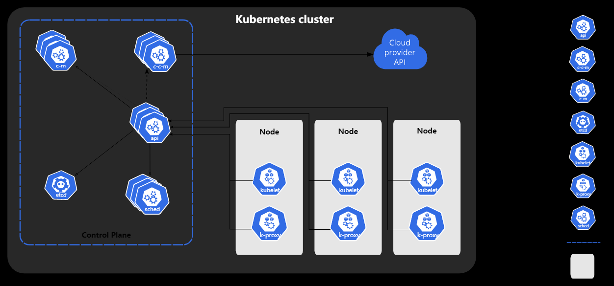

### k8s是什么?
Kubernetes 是一个可移植的、可扩展的开源平台，用于管理容器化的工作负载和服务，可促进声明式配置和自动化。

### 为什么需要它?
在生产环境中,需要管理运行容器并确保容器的高可用。k8s提供以下开箱即用的功能：
- 服务发现和负载均衡 
   
    Kubernetes 可以使用 DNS 名称或自己的 IP 地址公开容器，如果进入容器的流量很大， Kubernetes 可以负载均衡并分配网络流量，从而使部署稳定。
  

- 存储编排
  Kubernetes 允许你自动挂载你选择的存储系统，例如本地存储、公共云提供商等。

- 自动部署与回滚

  你可以使用 Kubernetes 描述已部署容器的所需状态，它可以以受控的速率将实际状态 更改为期望状态。例如，你可以自动化 Kubernetes 来为你的部署创建新容器， 删除现有容器并将它们的所有资源用于新容器。

- 自动完成装箱计算

  Kubernetes 允许你指定每个容器所需 CPU 和内存（RAM）。 当容器指定了资源请求时，Kubernetes 可以做出更好的决策来管理容器的资源。

- 自我修复

  Kubernetes 重新启动失败的容器、替换容器、杀死不响应用户定义的 运行状况检查的容器，并且在准备好服务之前不将其通告给客户端。

- 密钥与配置管理

  Kubernetes 允许你存储和管理敏感信息，例如密码、OAuth 令牌和 ssh 密钥。 你可以在不重建容器镜像的情况下部署和更新密钥和应用程序配置，也无需在堆栈配置中暴露密钥。

### k8s架构

- master
  
    主节点对集群做出全局决策,以及检测和相应集群事件。
  
    - kube-apiserver
      
        集群对外API请求入口
      
    - kube-scheduler
      
        任务调度器，负责监视创建新创建的，未指定运行节点的pod，选择节点让pod在上面运行，决策因素包括单个pod和pod集合的资源需求，硬件/软件/策略约束、亲和性和反亲性规范、数据位置、工作负载见的干扰和最后时限。
      
    - kube-controller-manager
      
        处理常规后台任务，为了降低复杂性都被编译到了同一个执行文件，并在一个进程运行。
    
      - 节点控制器（Node Controller）: 负责在节点出现故障时进行通知和响应
      - 任务控制器（Job controller）: 监测代表一次性任务的 Job 对象，然后创建 Pods 来运行这些任务直至完成
      - 端点控制器（Endpoints Controller）: 填充端点(Endpoints)对象(即加入 Service 与 Pod)
      -  服务帐户和令牌控制器（Service Account & Token Controllers）: 为新的命名空间创建默认帐户和 API 访问令
        
    - etcd

      etcd 是兼具一致性和高可用性的键值数据库，可以作为保存 Kubernetes 所有集群数据的后台数据库。

- node

    - kubelet
    
       集群在每个node上的操作代理
    
    - kube-proxy
    
        集群在每个ndoe上的网络代理
    
    - container runtime
    
        容器运行环境

### k8s三个重要概念

#### pod
- 最小部署单元
- 一组容器集合
- 共享网络
- 生命周期短暂

#### controller
- 确保预期的pod副本数量
- 无状态应用数量部署
- 有状态应用部署
- 一次性任务和定时任务
- 确保所有node运行同一个pod

#### service
- 定义一组pod的访问规则